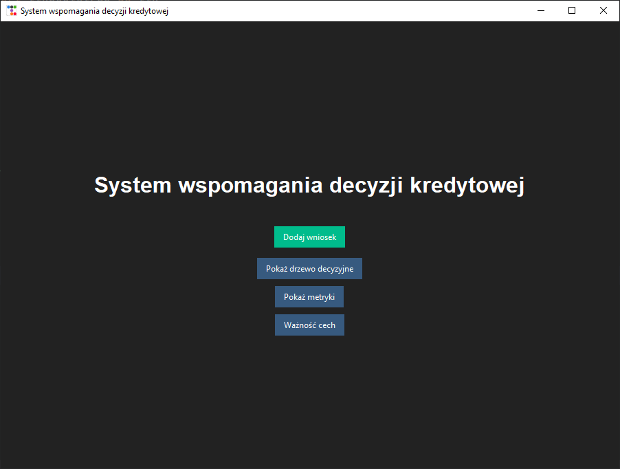
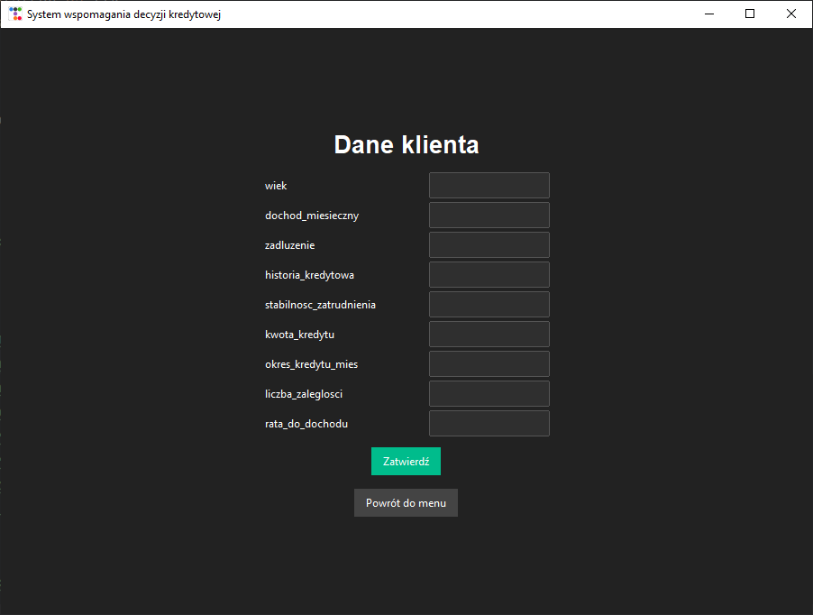
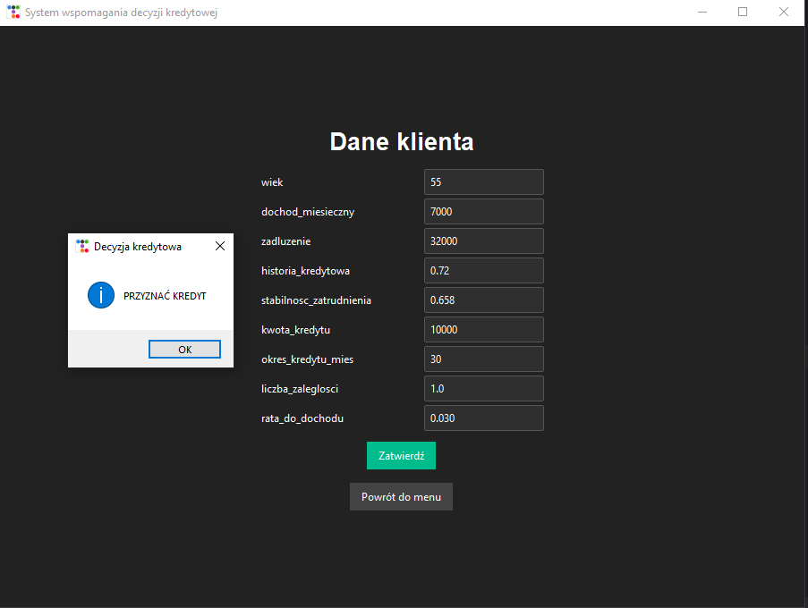
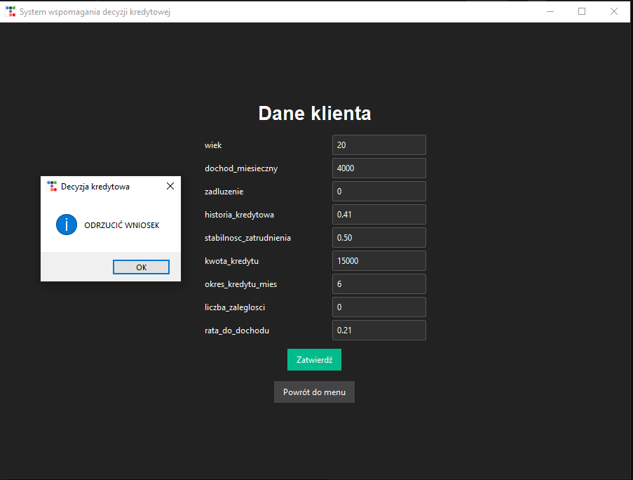
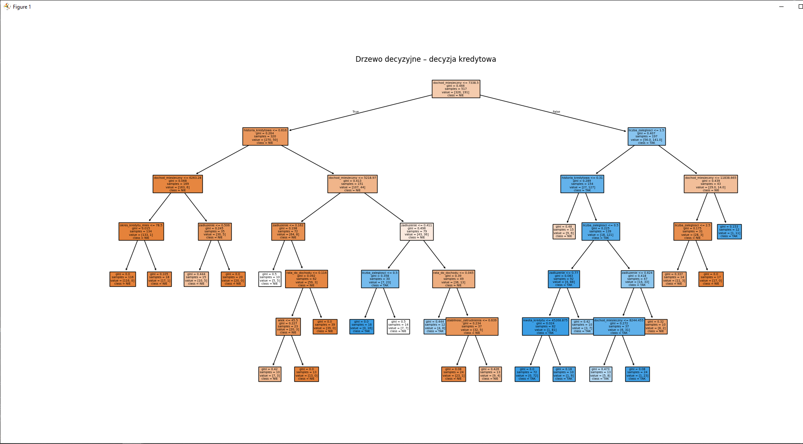
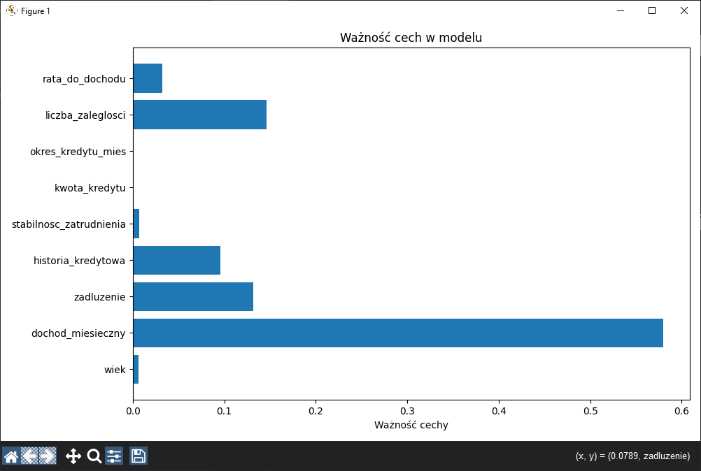
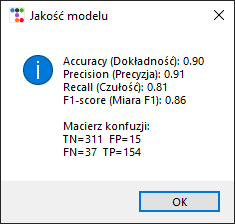

## System wspomagania decyzji kredytowej (Python + ML)

Aplikacja desktopowa wykorzystująca **uczenie maszynowe (Decision Tree)** do oceny wniosków kredytowych. Projekt łączy **Python**, **scikit‑learn**, **pandas**, **matplotlib** oraz **GUI w ttkbootstrap**. System umożliwia predykcję decyzji kredytowej, wizualizację modelu oraz analizę jakości i ważności cech.

---

## Cel projektu

Celem projektu jest stworzenie kompletnego narzędzia do wspomagania decyzji kredytowych, które:

- trenuje model ML na danych finansowych,
- pozwala użytkownikowi wprowadzać nowe wnioski,
- automatycznie aktualizuje model po każdym nowym przypadku,
- prezentuje interpretowalne wyniki (drzewo, metryki, ważność cech),
- posiada intuicyjny interfejs graficzny.

Projekt pokazuje praktyczne wykorzystanie ML w aplikacji użytkowej oraz umiejętność łączenia backendu, analizy danych i GUI.

---

## Technologie

- **Python 3**
- **scikit-learn** – model ML (DecisionTreeClassifier)
- **pandas** – przetwarzanie danych
- **matplotlib** – wizualizacje
- **tkinter + ttkbootstrap** – interfejs graficzny
- **CSV** – lokalna baza danych

---

## Zrzuty ekranu

### Menu główne


*Ekran startowy aplikacji z dostępem do wszystkich funkcji: dodawania wniosku, wyświetlania drzewa decyzyjnego, metryk oraz ważności cech.*


### Formularz wprowadzania danych


*Widok formularza, w którym użytkownik wpisuje dane finansowe klienta, aby sprawdzić decyzję kredytową.*


### Decyzja pozytywna – przyznanie kredytu


*Okno dialogowe informujące, że na podstawie podanych danych model przyznał kredyt.*


### Decyzja negatywna – odrzucenie wniosku


*Okno dialogowe informujące, że model odrzucił wniosek kredytowy.*


### Drzewo decyzyjne


*Wizualizacja drzewa decyzyjnego używanego do klasyfikacji wniosków kredytowych.*


### Ważność cech (feature importance)


*Wykres przedstawiający wpływ poszczególnych cech na decyzję modelu.*


### Metryki jakości modelu oraz macierz konfuzji


*Zestawienie accuracy, precision, recall, F1-score oraz macierzy konfuzji dla aktualnego modelu.*


---

## Funkcjonalności aplikacji

- Formularz do wprowadzania danych klienta.
- Predykcja decyzji kredytowej (TAK/NIE).
- Zapis nowych przypadków do pliku CSV.
- Automatyczne ponowne trenowanie modelu.
- Wizualizacja:
  - drzewa decyzyjnego,
  - metryk jakości modelu (accuracy, precision, recall, F1),
  - ważności cech.
- Interfejs w stylu *darkly* (ttkbootstrap).

---

## Dane wejściowe

Aplikacja korzysta z pliku:

```
credit_data_synthetic.csv
```


Wymagane kolumny:

- wiek  
- dochod_miesieczny  
- zadluzenie  
- historia_kredytowa  
- stabilnosc_zatrudnienia  
- kwota_kredytu  
- okres_kredytu_mies  
- liczba_zaleglosci  
- rata_do_dochodu  
- decyzja (0/1)

---

## Model ML

Model: **DecisionTreeClassifier**

Parametry:
- criterion: gini  
- max_depth: 6  
- min_samples_leaf: 10  
- random_state: 42  

Model jest trenowany:
- przy starcie aplikacji,
- po każdym dodaniu nowego wniosku.

---

## Uruchomienie

Instalacja zależności:

```bash
pip install pandas scikit-learn matplotlib ttkbootstrap
```

Start aplikacji:

```bash
python main.py
```

---

## Struktura projektu

- `main.py` – logika aplikacji + GUI  
- `credit_data_synthetic.csv` – dane treningowe i nowe przypadki  
- Funkcje:
  - `train_model()` – trenowanie modelu
  - `evaluate_and_save()` – predykcja + zapis + retraining
  - `show_tree()` – wizualizacja drzewa
  - `show_metrics()` – metryki modelu
  - `show_feature_importance()` – ważność cech
  - `open_form()` – formularz danych klienta
